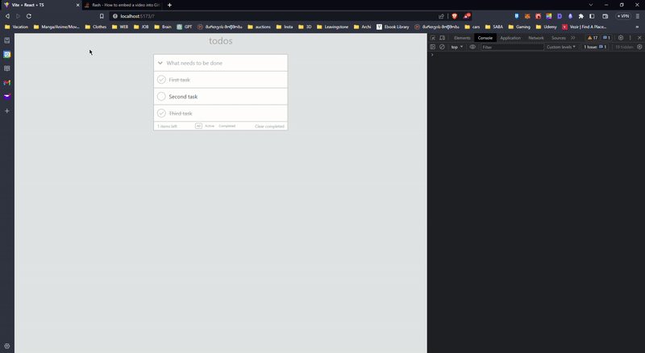

System and thoughprocess

For starters I wrapped todoApp in contextAPi and inserted all the common and frequently used variables inside

In TodoApp I separated app in 3 parts
1)Header
2)TaskList(Body)
3)Footer

1. In header u can add new task by clicking "What needs to be done" input field, after entering character you have to
   click enter so the new task can be entered in TaskList.
   By clicking "Arrow down" icon you can check all the tasks as complete.

2. In task list you can see your tasks, check them as complete or active by clicking on left side on oval button, if
   it's complete it shows checkmark, if it's not it just round shape.
   if you want to edit a tasks name, you have to double click on the task and the task object will copied and moved to header,
   in header you will be able to change its name and after clicking enter you can change name.
   you can also delete tasks, by hovering over it you will see cross button to the right side of task, when u click it will
   disappear from task list.

3. In the footer section we can see how many active tasks we have left, and it change on active time.
   In the middle section we can also filter task list by clicking All, active and completed buttons.
   At the right side of the footer we have Clear Completed button, by clicking it all the completed tasks that has been check will
   disappear from taskslist.

